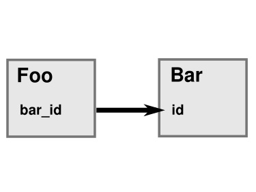

DomainQL
========

Annotation-based convention over configuration GraphQL schema generator.


Technologies involved:
 * Java 8 / Spring
 * [graphql-java](https://github.com/graphql-java/graphql-java)
 * [jooq](https://www.jooq.org/) 


# Usage

1. Design a database schema
   
   The current convention following JOOQ defaults would be to specify all field names separated with underscores.
   
   The foreign key fields are supposed to end with a configurable suffix, by default "_id".
   
   Examples:
   
    * pk column `id`
    * Column `full_name`
    * Foreign key column `billing_address_id`
  
2. Generate Java classes with JOOQ to access that database schema
   
   ## JOOQ codegen example
   
   ```xml
    <plugin>
    
       <groupId>org.jooq</groupId>
        <artifactId>jooq-codegen-maven</artifactId>
        <version>3.10.6</version>
        
        <!-- Specify the plugin configuration.
             The configuration format is the same as for the standalone code generator -->
        <configuration>
    
            <!-- JDBC connection parameters -->
            <jdbc>
                <driver>org.postgresql.Driver</driver>
                <url>jdbc:postgresql://localhost/${YOUR_DATABASE}</url>
                <user>${YOUR_USER}</user>
                <password>${YOUR_USER}</password>
            </jdbc>
    
            <!-- Generator parameters -->
            <generator>
                <database>
                    <name>org.jooq.util.postgres.PostgresDatabase</name>
                    <includes>.*</includes>
                    <excludes></excludes>
                    <inputSchema>public</inputSchema>
                </database>
                <target>
                    <packageName>${YOUR_DOMAIN_PACKAGE}</packageName>
                    <directory>src/main/java</directory>
                </target>
                <generate>
                    <pojos>true</pojos>
                    <records>true</records>
                    <generatedAnnotation>true</generatedAnnotation>
                    <validationAnnotations>true</validationAnnotations>
                    <jpaAnnotations>true</jpaAnnotations>
                    <springAnnotations>true</springAnnotations>
                </generate>
            </generator>
        </configuration>
    </plugin>
    
   ```
   
   Note the `<jpaAnnotations>true</jpaAnnotations>` configuration. The POJOs *must* be
   generated with JPA annotations.
 
 3. Implement Queries and Mutators
 
    With the basic GraphQL types being generared from the JOOQ POJO classes, we just need Queries and Mutators 
    for the GraphQL. 
    
    Here we see a simple JOOQ-based query that provides a paged list of all Customer POJOs.
    
    ```java
    @GraphQLQuery
    public List<Product> products(
        @GraphQLField( defaultValue = "0")
        int offset,
        @GraphQLField( defaultValue = "100")
        int limit
    )
    {
        return dslContext.select()
            .from(PRODUCT)
            .limit(limit)
            .offset(offset)
            .fetchInto(
                Product.class
            );
    }
    ```
    
    Query methods are annotated with @GraphQLQuery, mutations with @GraphQLMutations. You can use @GraphQLField 
    annotations on the method parameters to (re)define name, description or not-null status. If the Java compiler 
    provided method parameter names (-parameters switch on Javac) the method parameter names will be automatically used 
    from the Java parameters. Otherwise you will need to provide the correct name for
    every query or mutation parameter via @GraphQLField
  
 4. Use DomainQL on generated Schema
 
    ```java
        // get all spring beans annotated with @GraphQLLogic 
        final Collection<Object> logicBeans = applicationContext.getBeansWithAnnotation(GraphQLLogic.class).values();
        
        GraphQLSchema schema = DomainQL.newDomainQL(dslContext)
            .logicBeans(logicBeans)
            // generate schema for all tables of the generated JOOQ schema
            .objectTypes(Public.PUBLIC)
        
            // configure object creation for schema relationships
            .configureRelation( ...)
            .buildGraphQLSchema();
   
    ```
  
# Relation configuration

The generated JOOQ schema contains information about the foreign key columns in the database. DomainQL can optionally
create embedded objects and collections based on the foreign keys, it just needs to be told what to do.

The configureRelation() method of the DomainQL builder can be used to configure additional fields for the JOOQ foreign 
key definitions.

You will find all of them in the generated "Keys" class in your JOOQ codegen target directory.

```java
    .configureRelation(Keys.FOO__FK_FOO_BAR_ID, SourceField.OBJECT, TargetField.NONE)

```

Let's take a look at the SourceField/TargetField configuration variants.

Imagine we have a relationship between two entities "Foo" and "Bar". "Foo" has a foreign key column "bar_id" that 
references the primary key "id" of "Bar".



## Source Field Configuration

The SourceField enum controls the left / source side of the relation.

### SourceField.SCALAR

There is no special handling of the relation ship. Foo will only receive a plain "barId" field.

### SourceField.OBJECT

The target of the relation will be embedded as GraphQL object. By default, the algorithm will name the embedded object 
like the underlying foreign key stripped of the foreign key suffix ("_id" by default).

Foo will receive a full "bar" object field.

### SourceField.OBJECT_AND_SCALAR

Both the foreign key field itself and the embedded target object will be created. This is useful in situtations where 
you want the embedded object in some cases, but in others you can save some querying because all you need is the target 
id. 

### SourceField.NONE

The relationship is ignored and does not appear in the GraphQL schema. 


## Target Field Configuration

The TargetField enum controls the field generating on the right / target side of the foreign key relation. 

### TargetField.ONE

TargetField.ONE interprets the foreign key relation as a one-to-one relation and adds a single "foo" field to the "Bar" 
type. 

### TargetField.MANY

TargetField.ONE interprets the foreign key relation as a one-to-one relation and adds a list field called "foos" field 
to the "Bar" type.

By default the plural is formed with the evo-inflector library. 

### TargetField.NONE
  
No field is added on the right-hand / target side.
  
  
## Foreign key field names

The default rules for forming embedded object field names out of the foreign key should work reasonably well. You can 
however fine-control the generated field names by using the `.configureRelation(SourceField,TargetField,String,String)` 
method of the builder.

This will be necessary to prevent the embedded objects of the same type from multiple foreign keys 
from conflicting with each other    
